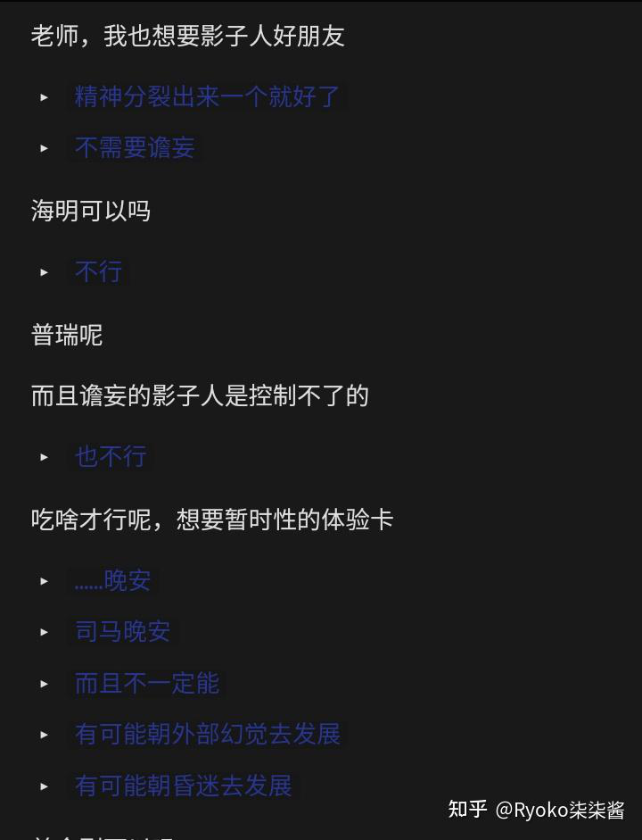

# 受害者有罪论分析&od的娱乐性本质——关于od的观察分析总结之一 #

当今社会，在本人的了解范围内，新出现了三类人群正面临需求着迫切的帮助：药物滥用者（Oder）、跨性别女性（MTF）以及地雷系男女。

与抑郁和双相情感障碍等精神疾病患者相比，这三类人群往往受到更多的误解和排斥。当人们了解到他们的身份后，往往会不屑一顾，甚至以“可怜之人必有可恨之处”为由拒绝给予他们应有的关爱。

为何这三者的地位会有如此显著的差异呢？笔者以此为逻辑起点，展开了调查研究。

## 一、“可怜之人必有可恨之处”的论调实际上是一种不公平的区别对待。

笔者在社交媒体上观察到，这三类人群与精神疾病患者之间存在极高的重合度。因此，“可怜之人必有可恨之处”的论调实际上是一种不公平的区别对待。

每个人都有其局限性，即所谓的“可恨之处”，但大多数人能够很好地隐藏这些缺点，或者在平等和谐的交流中无需刻意寻找对方的不足。然而，对于那些处于困境中的人们而言，一旦遭遇冷漠的态度，他们的不幸便会被扭曲成可憎，从而被他人所回避，这是一种趋利避害的心理机制。

更进一步讲，即使这些人表现出某些令人不满的行为，也往往是生活条件所迫的结果。试想，让一个食不果腹、衣不蔽体的人去乐善好施，几乎是不可能的事情。

因此，所有身处困境的人都值得我们伸出援手，而真正可恨的是那些明知社会存在不公却依然劝人放弃助人情怀的麻木者。

甚至于，我们不应将他们视为“可怜”，而是应当以平等的视角看待每一个人。他们是各有各的不幸，而不是可恨；他们各有各的性格与故事，有的亦让笔者我在深入浏览的过程中感到有趣或共情。或许，正是出于这样的感悟，许多人才会毅然决然地选择帮助他人。

## 二、Oder中无论正当用药者还是享乐主义者，其最终目的都只是为了追求快乐，这与他们这么做的原因与遭受的痛苦并不矛盾。

关于药物滥用者（Oder），有人将其分为两类：

第一类是由于严重的心理疾病，常规治疗手段难以缓解症状，只能通过药物解离作用来应对。这类人可以被称为正当用药者；

第二类则是为了追求感官上的刺激或新奇体验。例如，通过致幻剂进入迷幻状态，或因谵妄而试图看到“影子人”，甚至尝试分裂人格以寻求乐趣。这类人则可称为享乐主义者。

[back](./)
